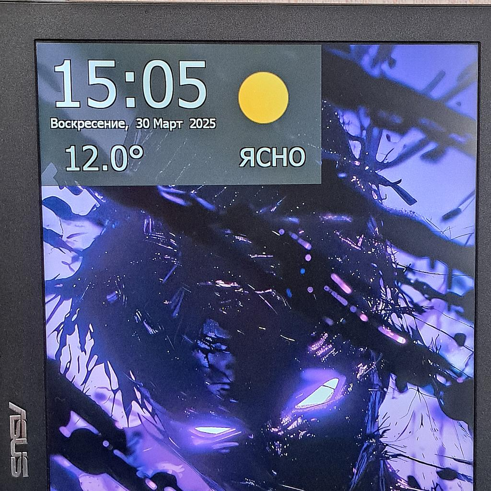

# My Home Weather

Виджет для рабочего стола с часами и погодой.

Для работы необходимо настроить файл settings.json, задать широту и долготу на которой показывается текущая погода, а так же зарегистрироваться на сайте openweathermap.org и сгенерирровать бесплатный ключ доступа к API (https://home.openweathermap.org/api_keys).

	"latitude" : "12.34",
	"longitude" : "56.78",
	"appid" : "appid from openweathermap.org"

